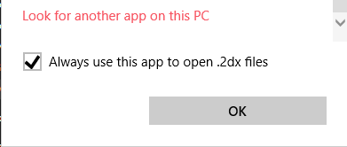

# 2dxPlay
Play konami 2dx files from the command line.

Install with pip and run it from anywhere.  
`pip install 2dxPlay`

### Usage:
Show help: `2dxplay -h`  
Play a 2dx file: `2dxplay infile.2dx`  
Extract all tracks from a 2dx file: `2dxplay infile.2dx -e`  
Extract specific tracks from a 2dx file: `2dxplay infile.2dx -e 1,2-5,10`

If the file contains more than one wav, it will play all tracks sequentially.  
Press Ctrl+C to pause playback. You will be presented with a menu:  
`Enter track number to jump to, e [track(s) to extract], or q to quit:`

###Tip: Play any 2dx file just by double clicking on it:
Right click on a 2dx file, choose Open With > Look for another app on this PC.  
Navigate to your python installation where 2dxPlay.exe is installed. (I use python 3.7, so pip 
installed it in `%appdata%\Local\Programs\Python\Python37\Scripts`).  
Check the "Always use this app" box and hit OK.

